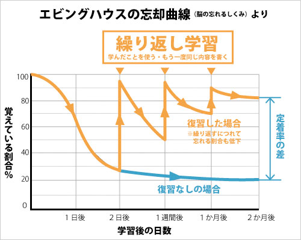

# Relearn

# アプリ概要

復習特化型のToDoアプリです。
https://re-learn.work/

<アプリの投稿詳細画面>

# このアプリでできること

・エビングハウスの忘却曲線に沿ってベストな復習タイミングをメールで通知してくれます。

・効率的に学習ができます（通知きた時にだけ復習します。）

・グラフから忘れ具合を把握できます

# エビングハウスの概念について
一度記憶されたことは下記画像のように忘れていきますが、ベストタイミングに復習することで忘れにくくなります。

# このアプリ作成した理由

学習したことを効率的に復習したいと思い、このアプリを制作しました。

これからの 100 年時代では学びは主要テーマになってくると思います。

自分がこんなアプリを使いたかったところもありますが、色んな方に使っていただいて

みなさんと一緒に成長していきたいです。

# ターゲットユーザ

長期記憶につながる学習を効率的にしたい方

# 主な利用シーン

復習した内容があるが、自分では管理が手間な場合

# デプロイ環境
Ruby: 2.7.1  
Rails: 5.2.4.3  
DB: MySQL  
OS: Linux  
WEBサーバー: Nginx  
Appサーバー: Puma  

## 設計書

https://docs.google.com/spreadsheets/d/1V74t9IswrUKbrx4Mw2WNSCY-W1GDhJ9IyJlibP1A6KE/edit#gid=1418441861

## 機能一覧

<https://docs.google.com/spreadsheets/d/15qeQrXbdv3tIt33XQfzTTch51YNXkE0QgNAu1W90Lrc/edit#gid=493036790>